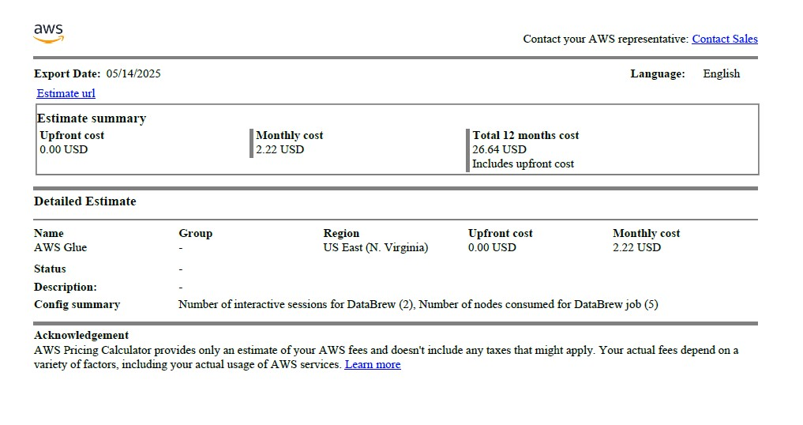
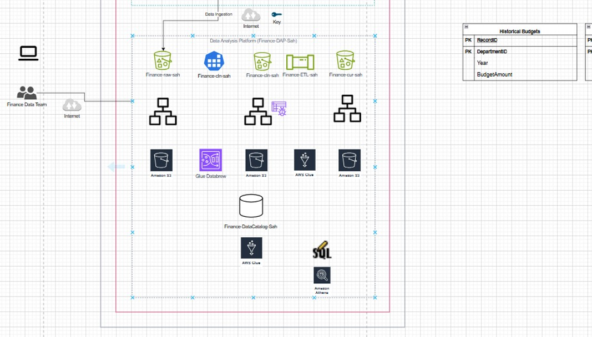

# AWS Project 3 – Data Processing and Analysis using AWS Glue & Athena

This project focuses on creating an efficient ETL (Extract, Transform, Load) pipeline using **AWS Glue** and analyzing the results using **AWS Athena**. The work includes cost analysis, designing the ETL workflow, implementing the data pipeline, and running SQL-like queries to understand the data better.

## Project Overview

The goal of this project was to:

- Explore data profiling and cleaning
- Design and implement a working ETL pipeline using AWS Glue
- Perform serverless querying using Athena
- Track service usage and monitor billing to maintain cost-efficiency

## Work Summary

### 1. Cost Evaluation using Billing Dashboard

- Checked the **AWS Billing Dashboard** to review the costs of services used.
- Helped track resource consumption and manage the project budget.

<!--  -->

### 2. ETL Design and Planning

- Mapped out the entire data pipeline:
  - **Source**: Identified where the raw data was coming from
  - **Transform**: Planned how the data would be cleaned and processed
  - **Load**: Chose where the processed data would be stored

<!--  -->

### 3. ETL Implementation using AWS Glue

- Set up **AWS Glue jobs** to run the ETL pipeline.
- Created scripts to clean and transform the data.
- Verified data integrity after processing.

<!--  -->

### 4. Data Storage and Output Review

- Uploaded cleaned datasets into **Amazon S3** with organized folder structures:
  - By department
  - By historical data
  - By revenue segments

<!--  -->
<!--  -->
<!--  -->

### 5. Data Validation and Final Output

- Cross-checked final outputs with **initial ground truth**:
  - Used cleaned views from DataBrew and Athena results
- Ensured accuracy of transformations and matches across sources

<!--  -->
<!--  -->
<!--  -->

## Tools and Technologies

- AWS Glue – for ETL processing
- AWS Athena – for querying structured data
- Amazon S3 – for storing processed datasets
- AWS Billing Dashboard – for monitoring service usage

## Summary

This project gave me real-world practice in building and managing ETL processes using **AWS Glue** and **Athena**. I learned how to automate data pipelines, run queries without managing servers, and monitor costs for cloud-based data engineering tasks.

Next steps could include automating the ETL trigger using AWS EventBridge or Step Functions, and connecting data outputs to BI tools like QuickSight or Tableau for visualization.
