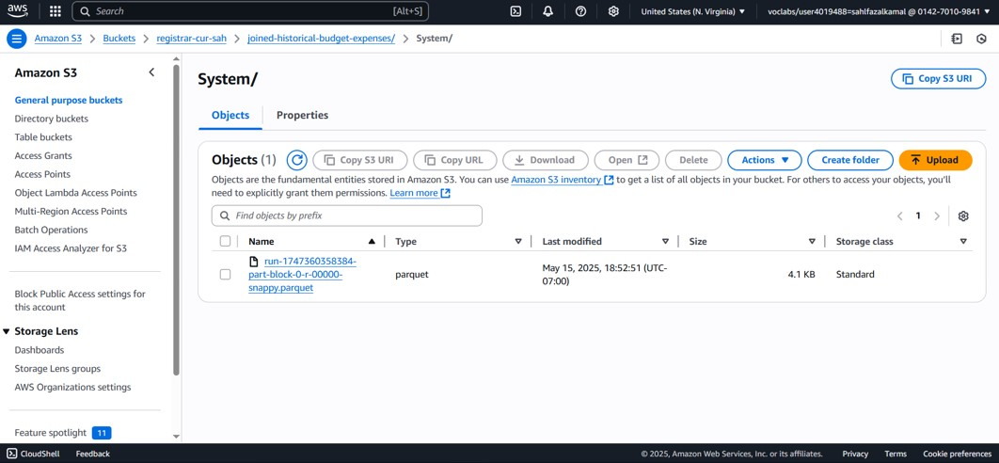
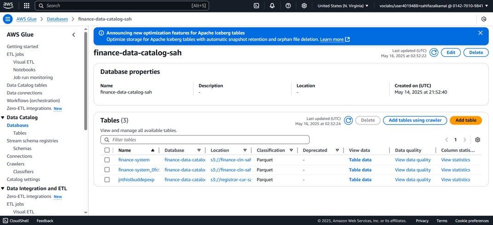
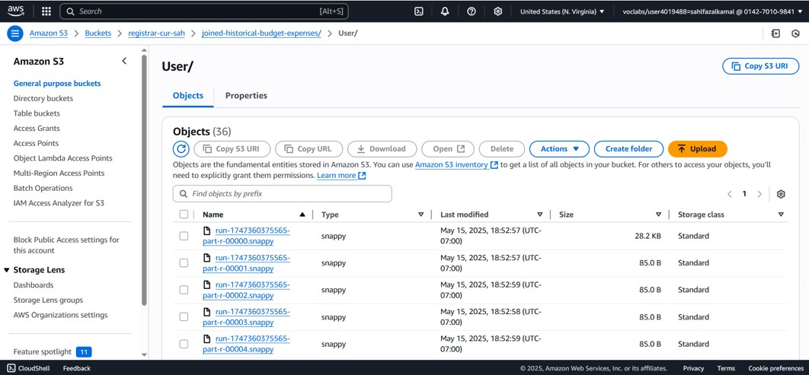
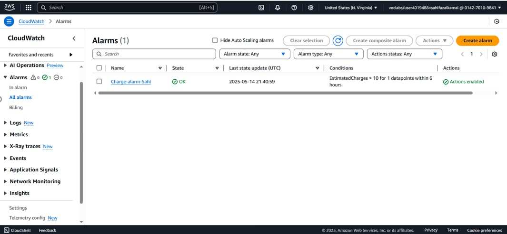

# AWS Project 3 – Building a Scalable Budget Forecasting and Cost Monitoring System

This project demonstrates how I built a complete AWS cloud pipeline for organizing, processing, and analyzing budget data. The goal was to clean, prepare, store, and query historical budget records, and enable real-time insights with billing alerts.

## Project Objective

To help an organization streamline their budget analysis and monitoring efforts using AWS Glue, DataBrew, Athena, S3, and CloudWatch. The project uses a cloud-native architecture to handle raw datasets, transform them, and store them in a query-ready format.

## Key Steps and Activities

### 1. Data Lake Setup with Amazon S3

- Uploaded historical financial data into Amazon S3
- Created multiple S3 buckets for raw, cleaned, and curated data
- Used structured folders and descriptive naming

### 2. AWS Glue Data Catalog Configuration

- Created a Data Catalog using AWS Glue
- Registered tables with accurate metadata
- Ensured schema recognition for further transformation

### 3. Visual ETL Using AWS Glue DataBrew

- Used DataBrew to visually clean and transform datasets
- Merged multiple sources like department, revenue, and budget files
- Set up transformations like removing nulls, converting types, etc.

### 4. Querying with Amazon Athena

- Queried joined datasets using Athena for insights
- Previewed schema and validated transformation accuracy
- Used SQL to extract cost patterns and department analysis

### 5. Budget Cost Monitoring and Alerts

- Set up billing alerts using CloudWatch
- Created alarm conditions for estimated charges exceeding threshold
- Used alarm metrics to notify users

## Cost Estimate

Estimated cost was generated using the AWS Pricing Calculator. Based on Glue sessions and usage pattern, the projected monthly cost was minimal.

## Final Architecture Diagram

An architecture diagram showing the complete flow—from ingestion to storage, transformation, and query.

## Tools Used

- Amazon S3 – Storage buckets for raw and curated data
- AWS Glue – Data catalog and schema registry
- AWS Glue DataBrew – Visual ETL tool for transformation
- Amazon Athena – SQL queries on transformed data
- Amazon CloudWatch – Billing alerts and monitoring

## Summary

With this AWS setup, the finance team can now analyze departmental spending, track budget accuracy, and receive alerts on cost overruns. The modular ETL process makes updates simple and ensures future datasets can be integrated easily.

